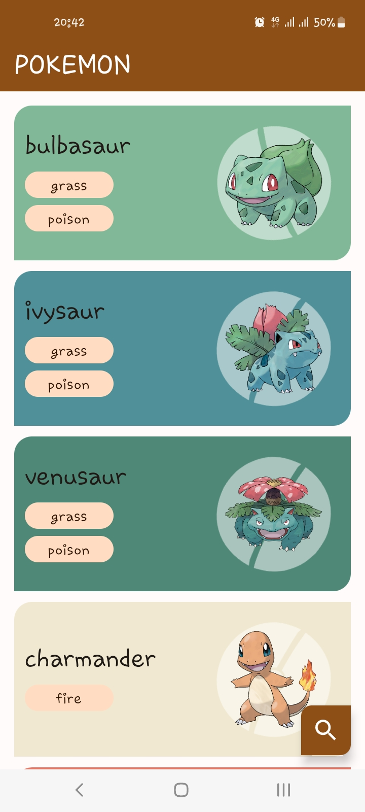
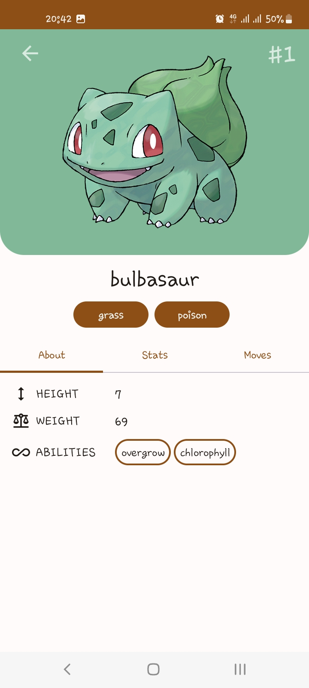
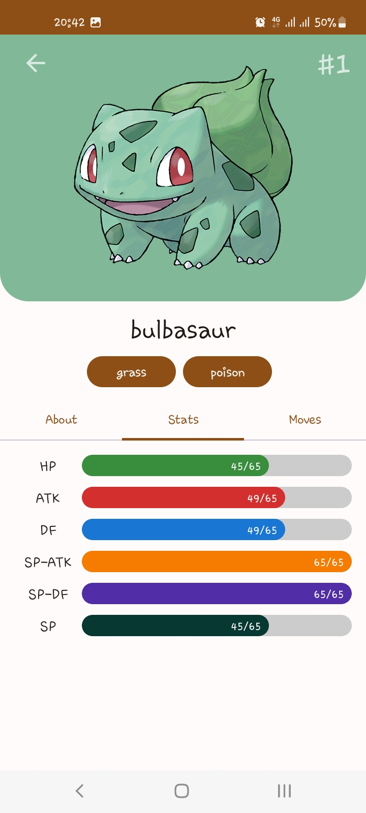
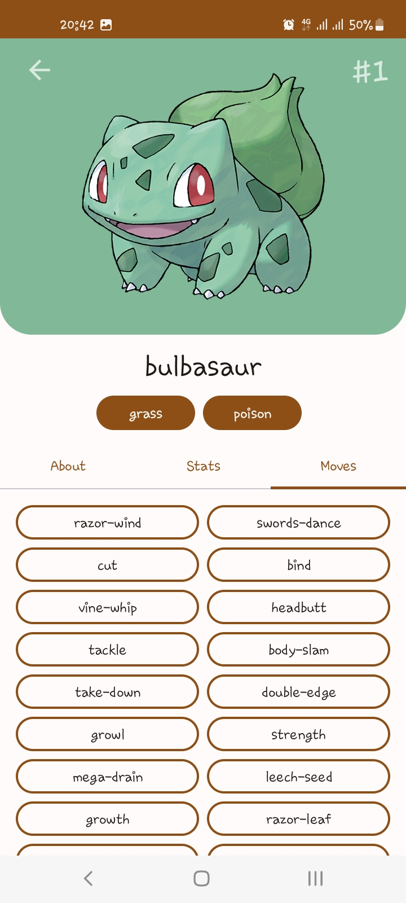

# Pokedex App

Pokedex app built with Jetpack Compose 
shows all Pokemons using paging3 and retrofit

## Screenshots

    
    
    
    

## Development Roadmap

- Jetpack Compose
- Paging 3
- Retrofit
- Coil
- Palette
- Hilt
- PokeApi